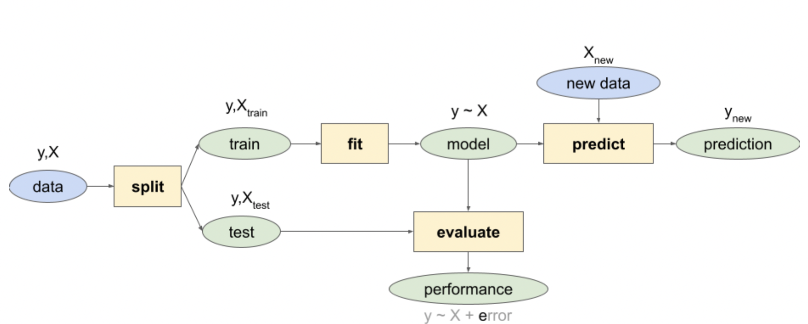

```{r setup, include=FALSE}
knitr::opts_chunk$set(echo = TRUE, warning = FALSE)

librarian::shelf(
  DT, dplyr, dismo, GGally, here, readr, tidyr)
select <- dplyr::select # overwrite raster::select
options(readr.show_col_types = F)
```

## 1 Explore (cont'd)
```{r}
dir_data    <- here("data/sdm")
pts_env_csv <- file.path(dir_data, "pts_env.csv")

# import data and count rows
pts_env <- read_csv(pts_env_csv)
count <- nrow(pts_env)
count
```


## 1.1 View imported data
```{r}
datatable(pts_env, rownames = F)
```


## 1.2 Exploratory Correlations
```{r}
GGally::ggpairs(
  select(pts_env, -ID),
  aes(color = factor(present)))
```
# 2 Logistic Regression



## 2.1 Setup Data
```{r}
# setup model data
d <- pts_env %>% 
  select(-ID) %>%  # remove terms we don't want to model
  tidyr::drop_na() # drop the rows with NA values
nrow(d)
```

## 2.2 Linear Model
```{r}
# fit a linear model
mdl <- lm(present ~ ., data = d)
summary(mdl)

# predicted range
y_predict <- predict(mdl, d, type="response")
y_true    <- d$present

range(y_predict)

range(y_true)

```

## 2.3 Generalized Linear Model (GLM)
 - see https://www.statmethods.net/advstats/glm.html for help
 - With a GLM, a logistic transformation is done to constrain the response terms between the two possible values, present (1) or absent (0).
```{r}
# fit a generalized linear model with a binomial logit link function
mdl <- glm(present ~ ., family = binomial(link="logit"), data = d)
summary(mdl)


y_predict <- predict(mdl, d, type="response")

range(y_predict)

# show term plots
termplot(mdl, partial.resid = TRUE, se = TRUE, main = F, ylim="free")

```

## 2.4 Generalized Additive Model
 - With a generalized additive model we can add “wiggle” to the relationship between predictor and response by introducing smooth s() terms.
```{r}
librarian::shelf(mgcv)

# fit a generalized additive model with smooth predictors
mdl <- mgcv::gam(
  formula = present ~ s(WC_alt) + s(WC_bio1) + 
    s(WC_bio2) + s(ER_tri) + s(ER_topoWet) + s(lon) + s(lat), 
  family = binomial, data = d)
summary(mdl)

# show term plots
plot(mdl, scale=0)

```

## 2.5 Maxent (Maximum Entropy)
- Maxent is probably the most commonly used species distribution model (Elith 2011) since it performs well with few input data points, only requires presence points (and samples background for comparison) and is easy to use with a Java graphical user interface (GUI).
```{r}
librarian::shelf(
  maptools, sf)

mdl_maxent_rds <- file.path(dir_data, "mdl_maxent.rds")

# show version of maxent
if (!interactive())
  maxent()

# get environmental rasters
# NOTE: the first part of Lab 1. SDM - Explore got updated to write this clipped environmental raster stack
env_stack_grd <- file.path(dir_data, "env_stack.grd")
env_stack <- stack(env_stack_grd)
plot(env_stack, nc=2)
```

```{r}
# get presence-only observation points (maxent extracts raster values for you)
obs_geo <- file.path(dir_data, "obs.geojson")
obs_sp <- read_sf(obs_geo) %>% 
  sf::as_Spatial() # maxent prefers sp::SpatialPoints over newer sf::sf class

# fit a maximum entropy model
if (!file.exists(mdl_maxent_rds)){
  mdl <- maxent(env_stack, obs_sp)
  readr::write_rds(mdl, mdl_maxent_rds)
}
mdl <- read_rds(mdl_maxent_rds)

# plot variable contributions per predictor
plot(mdl)

# plot term plots
response(mdl)

```

```{r}
# predict
y_predict <- predict(env_stack, mdl) #, ext=ext, progress='')

plot(y_predict, main='Maxent, raw prediction')
data(wrld_simpl, package="maptools")
plot(wrld_simpl, add=TRUE, border='dark grey')
```

